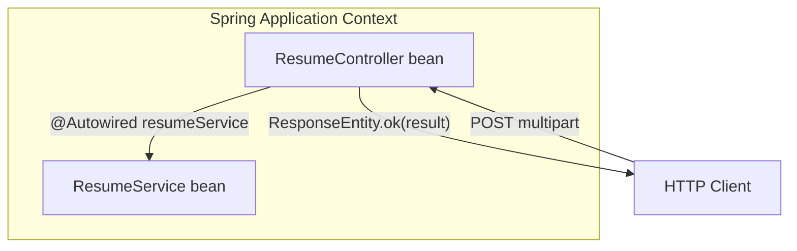

# Implementation

## Purpose

Complete source for the API layer stub: `ResumeController` + `ResumeService` wired via Spring dependency injection. Copy these files into the scaffolded project, rebuild, and proceed to Postman testing.

Design background: [controller-design.md](./controller-design.md), [service-stub.md](./service-stub.md).

---

## Files to create

```
src/main/java/com/resume/analyzer/
├── controller/
│   └── ResumeController.java    ← new
└── service/
    └── ResumeService.java       ← new
```

---

## `ResumeService.java` (stub)

Path: `src/main/java/com/resume/analyzer/service/ResumeService.java`

```java
package com.resume.analyzer.service;

import org.springframework.stereotype.Service;
import org.springframework.web.multipart.MultipartFile;

@Service
public class ResumeService {

    public String processResume(MultipartFile file, String role) {
        String fileName = file.getOriginalFilename();
        return "Resume received — file: " + fileName
                + ", role: " + role
                + ". Analysis pipeline not yet implemented.";
    }
}
```

Uses **Option B** style from service-stub (echo filename + role) for easy Postman verification.

---

## `ResumeController.java`

Path: `src/main/java/com/resume/analyzer/controller/ResumeController.java`

```java
package com.resume.analyzer.controller;

import org.springframework.beans.factory.annotation.Autowired;
import org.springframework.http.ResponseEntity;
import org.springframework.web.bind.annotation.PostMapping;
import org.springframework.web.bind.annotation.RequestMapping;
import org.springframework.web.bind.annotation.RequestParam;
import org.springframework.web.bind.annotation.RestController;
import org.springframework.web.multipart.MultipartFile;

import com.resume.analyzer.service.ResumeService;

@RestController
@RequestMapping("/resume")
public class ResumeController {

    @Autowired
    private ResumeService resumeService;

    @PostMapping("/upload")
    public ResponseEntity<String> uploadResume(
            @RequestParam("file") MultipartFile file,
            @RequestParam("role") String role) {

        String result = resumeService.processResume(file, role);
        return ResponseEntity.ok(result);
    }
}
```

---

## Wiring diagram



| Step | What Spring does |
|------|------------------|
| 1 | Component scan finds `@Service` → creates `ResumeService` |
| 2 | Component scan finds `@RestController` → creates `ResumeController` |
| 3 | `@Autowired` injects `ResumeService` into controller field |
| 4 | Request hits `uploadResume` → delegate → return 200 |

No manual `new ResumeService()` — container manages lifecycle.

---

## Alternative: constructor injection

Same behavior; preferred for unit tests:

```java
@RestController
@RequestMapping("/resume")
public class ResumeController {

    private final ResumeService resumeService;

    public ResumeController(ResumeService resumeService) {
        this.resumeService = resumeService;
    }

    @PostMapping("/upload")
    public ResponseEntity<String> uploadResume(
            @RequestParam("file") MultipartFile file,
            @RequestParam("role") String role) {

        String result = resumeService.processResume(file, role);
        return ResponseEntity.ok(result);
    }
}
```

Spring 4.3+ autowires single-constructor beans without `@Autowired` on constructor.

---

## Build and run

After adding both files:

```bash
./mvnw clean compile
./mvnw spring-boot:run
```

### Expected startup

- No bean creation errors
- Tomcat on port 8080
- `ResumeController` mapped: log line may show `Mapped "{[/resume/upload],methods=[POST]}"`

### Quick curl smoke test

```bash
curl -X POST "http://localhost:8080/resume/upload" \
  -F "file=@/path/to/any.pdf" \
  -F "role=Java Developer"
```

Expected body (example):

```text
Resume received — file: any.pdf, role: Java Developer. Analysis pipeline not yet implemented.
```

HTTP status: **200**.

---

## Implementation checklist

- [ ] `ResumeService.java` in `service` package with `@Service`
- [ ] `ResumeController.java` in `controller` package with `@RestController`
- [ ] Class-level `@RequestMapping("/resume")`
- [ ] Method `@PostMapping("/upload")`
- [ ] `resumeService.processResume(file, role)` called
- [ ] `ResponseEntity.ok(result)` returned
- [ ] `./mvnw clean compile` succeeds
- [ ] Endpoint responds 200 (curl or Postman)

---

## Common compile / runtime errors

| Error | Fix |
|-------|-----|
| `ResumeService cannot be resolved` | Check package imports in controller |
| `No mapping for POST /resume/upload` | Confirm app restarted; controller in scanned package |
| `Required request part 'file' is not present` | Use form field name `file`, not `resume` |
| `BeanCreationException` for JPA/datasource | Fix MySQL config or exclude autoconfig ([configuration.md](../scaffolding/configuration.md)) |

---

## What not to change when adding PDF logic

Keep identical:

- Controller class and method signature
- `processResume(MultipartFile file, String role)` signature
- `ResponseEntity.ok(...)` return pattern

Only replace the **body** of `ResumeService.processResume`.

---

## Link to prior context

Next: [postman-testing.md](./postman-testing.md) — detailed Postman steps and expected responses.
