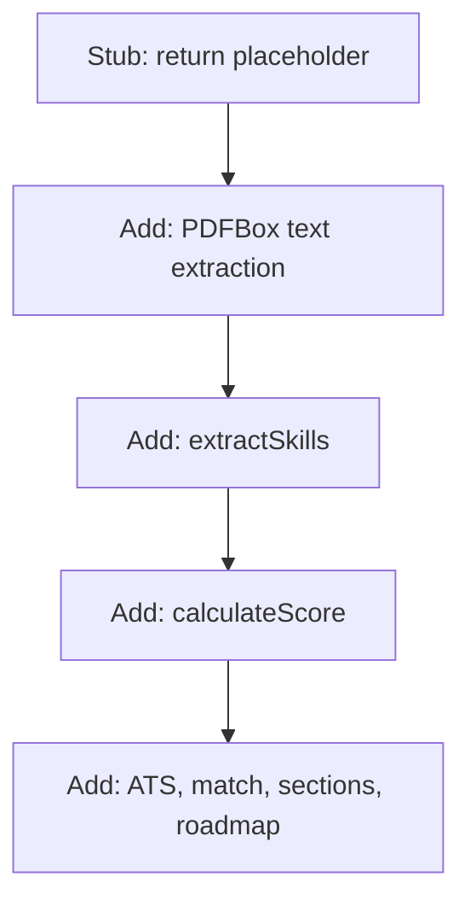

# Service Stub Design

## Purpose

Define `ResumeService` at **stub stage** — a Spring bean with one public method `processResume(MultipartFile, String)` that returns a placeholder string. Proves the controller → service wiring works before PDFBox or analysis logic are added.

File location: `src/main/java/com/resume/analyzer/service/ResumeService.java`

---

## Class responsibilities (stub stage)

| Does | Does not (yet) |
|------|----------------|
| Accept `MultipartFile` and `role` from controller | Open PDF with PDFBox |
| Return a non-empty `String` | Extract skills or scores |
| Register as Spring `@Service` bean | Call repository or database |
| Define stable method signature for later growth | Validate file type strictly |

The method signature **must not change** when real logic is added — only the method body expands.

---

## Annotation: `@Service`

```java
@Service
public class ResumeService {
```

| Effect | Detail |
|--------|--------|
| Component scan | Picked up by `@SpringBootApplication` in `com.resume.analyzer` |
| Bean name | Default `resumeService` (camelCase class name) |
| Injection | Autowired into `ResumeController` |

Equivalent to `@Component` with semantic meaning “business layer”.

---

## Public API (stable contract)

```java
public String processResume(MultipartFile file, String role)
```

| Parameter | Type | Stub usage | Future usage |
|-----------|------|------------|--------------|
| `file` | `MultipartFile` | May ignore content | PDF input stream for PDFBox |
| `role` | `String` | May ignore value | Job role matching + roadmap |

| Return | Type | Description |
|--------|------|-------------|
| Result | `String` | HTTP response body (plain text) |

---

## Stub implementation options

### Option A — Simple acknowledgment (minimal)

```java
public String processResume(MultipartFile file, String role) {
    return "Resume analysis will appear here. Upload received successfully.";
}
```

**Best for:** First Postman test proving endpoint + wiring only.

### Option B — Echo inputs (debug-friendly)

```java
public String processResume(MultipartFile file, String role) {
    String name = file.getOriginalFilename();
    return "Stub OK — file: " + name + ", role: " + role;
}
```

**Best for:** Verifying multipart binding and role param reach the service.

### Option C — Minimal labeled shape (UI-ready early)

```java
public String processResume(MultipartFile file, String role) {
    return "Skills: []\n"
         + "Score: 0/100\n"
         + "Suggestions: [Analysis pending]\n\n"
         + "Role: " + role + "\n"
         + "Match Score: 0%\n"
         + "Missing Skills: []\n\n"
         + "ATS Score: 0%\n"
         + "Missing Keywords: []\n\n"
         + "Resume Sections:\n"
         + "Skills Section: Missing ❌\n"
         + "Education Section: Missing ❌\n"
         + "Experience Section: Missing ❌\n\n"
         + "Career Roadmap for " + role + ":\n"
         + "[Analysis pending]";
}
```

**Best for:** Early frontend integration with correct parse labels (zeros/empty).

Pick one option for stub; **Option A or B** is enough for this segment’s deliverable.

---

## Recommended stub (reference)

```java
package com.resume.analyzer.service;

import org.springframework.stereotype.Service;
import org.springframework.web.multipart.MultipartFile;

@Service
public class ResumeService {

    public String processResume(MultipartFile file, String role) {
        return "Resume received for role: " + role
             + ". Analysis pipeline not yet implemented.";
    }
}
```

No imports beyond Spring and `MultipartFile`. No try/catch required at stub stage.

---

## Evolution path (later segments)

Same class, growing private helpers — controller unchanged:



| Segment | Service change |
|---------|----------------|
| API layer (now) | Stub `processResume` |
| PDF extraction | `PDDocument.load`, `PDFTextStripper` |
| Scoring & matching | Private methods + formatted return string |
| Error handling | try/catch → error message string |

Final `processResume` structure (preview):

```java
public String processResume(MultipartFile file, String role) {
    try {
        // 1. extract text from PDF
        // 2. skills, score, suggestions
        // 3. role match, ATS, sections, roadmap
        // 4. concatenate labeled string
        return formattedResult;
    } catch (Exception e) {
        return "Error while processing resume ❌";
    }
}
```

---

## What stub must not include

| Item | When added |
|------|------------|
| `PDDocument`, PDFBox imports | PDF segment |
| `ResumeRepository` | Persistence / optional |
| Keyword lists, scoring weights | Analysis segments |
| `@Transactional` | Only if DB writes added |

Keeps compile surface minimal and segment scope clear.

---

## Testing the stub in isolation

Future unit tests can mock `MultipartFile`:

```java
// Conceptual — full tests in later segment
when(file.getOriginalFilename()).thenReturn("resume.pdf");
String result = resumeService.processResume(file, "Java Developer");
assertTrue(result.contains("Java Developer"));
```

Not required for stub segment deliverable.

---

## Service checklist

- [ ] Class in `com.resume.analyzer.service`
- [ ] `@Service` annotation present
- [ ] Public method `processResume(MultipartFile file, String role)`
- [ ] Returns non-empty `String`
- [ ] No PDFBox or analysis code yet
- [ ] Compiles with `spring-boot-starter-web` only (no extra deps for stub)

---

## Link to prior context

Controller calls this service: [controller-design.md](./controller-design.md).  
Next: [implementation.md](./implementation.md) — complete `ResumeController` + `ResumeService` source together.
