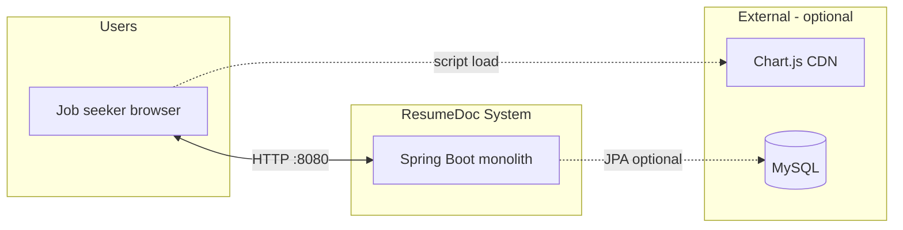
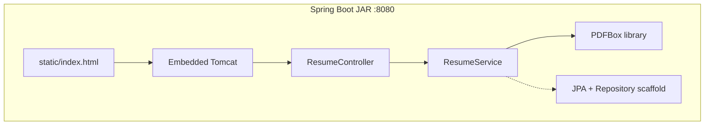
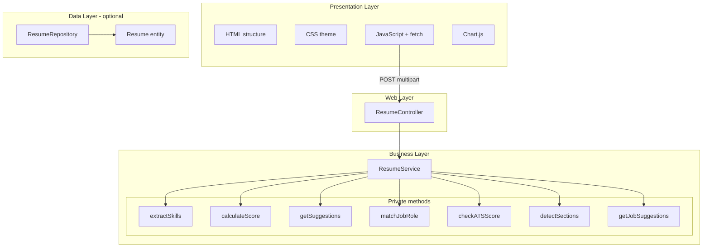
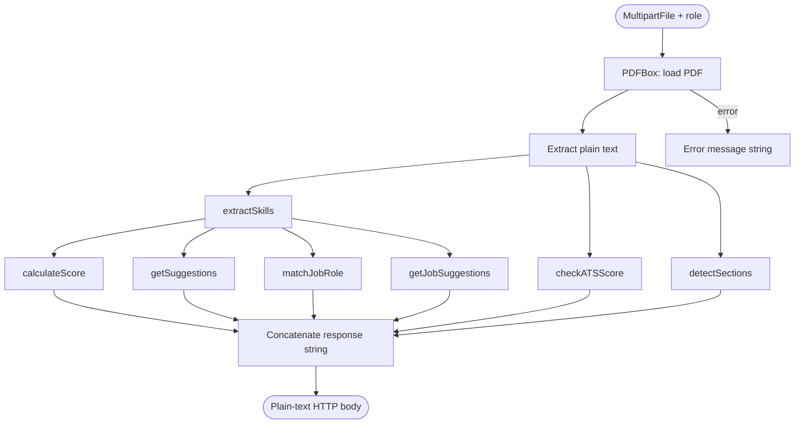
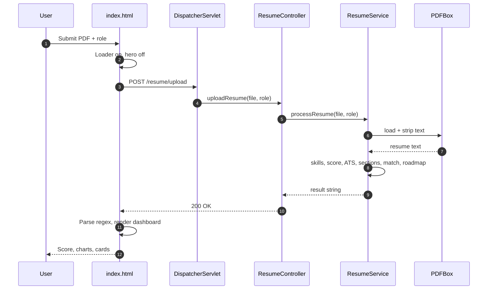
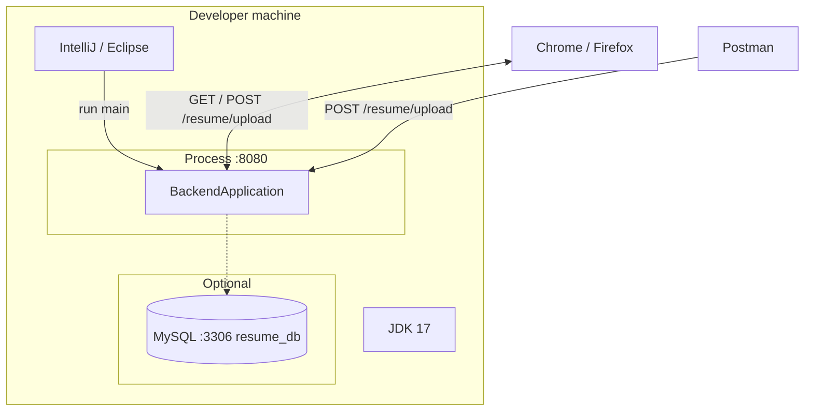
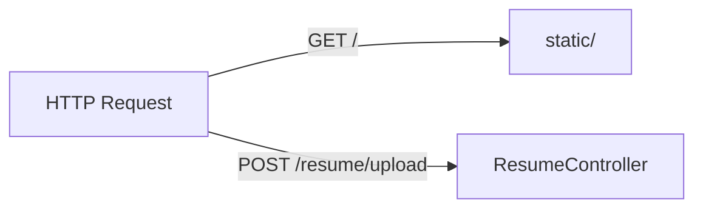
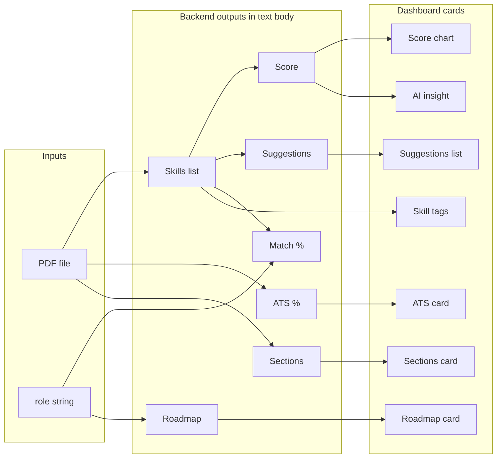
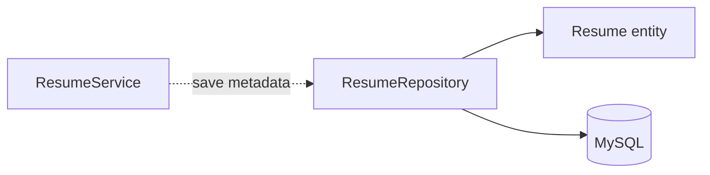

# Architecture Diagrams

## Purpose

Visual reference for ResumeDoc v1. Use alongside [overview.md](./overview.md), [layers-and-packages.md](./layers-and-packages.md), and [request-flow.md](./request-flow.md).

API field details remain in [api-contract.md](../requirements/api-contract.md).

---

## 1. System context (C4-style)

Who interacts with the system and what external systems exist.



| Actor / system | Relationship |
|----------------|--------------|
| Job seeker | Uploads PDF, reads dashboard |
| Spring Boot app | Hosts UI + API + analysis |
| Chart.js CDN | Client-side charts only |
| MySQL | Optional; not on v1 hot path |

---

## 2. Container view (single deployable)

Everything that ships in one JAR/process.



---

## 3. Application layers



---

## 4. Analysis pipeline (service internals)

Order of execution inside `processResume`:



---

## 5. Request/response sequence

Detailed interaction for one analyze action.



---

## 6. Local deployment topology



---

## 7. Static asset & API routing

How Tomcat maps URLs in v1.

| Request | Handler | Result |
|---------|---------|--------|
| `GET /` | ResourceHttpRequestHandler | `static/index.html` |
| `GET /index.html` | Static resource | Same page |
| `POST /resume/upload` | `ResumeController` | Analysis text |
| `GET /actuator/health` | Actuator (if exposed) | Health JSON |



---

## 8. Data flow — inputs to dashboard fields



---

## 9. Optional persistence (future path)

Dotted path not active in reference v1 `processResume`:



Enable when upload history feature ships ([future-scope.md](../requirements/future-scope.md)).

---

## 10. ASCII — monolith bird's eye

```
                    ┌─────────────────────────────────────┐
                    │         ResumeDoc (one JAR)         │
  Browser ─────────►│  Tomcat                             │
  GET  /            │    └─► static/index.html            │
  POST /resume/upload│    └─► ResumeController            │
                    │           └─► ResumeService         │
                    │                  ├─► PDFBox          │
                    │                  └─► keyword logic   │
                    │  [optional] JPA ──► MySQL           │
                    └─────────────────────────────────────┘
                              ▲
                              │ script tag
                         Chart.js CDN
```

---

## Diagram index

| # | Diagram | Use when |
|---|---------|----------|
| 1 | System context | Explaining scope to non-developers |
| 2 | Container / JAR | Deployment and repo structure |
| 3 | Application layers | Code organization |
| 4 | Analysis pipeline | Implementing or testing service |
| 5 | Sequence | Debugging request lifecycle |
| 6 | Local deployment | Environment setup |
| 7 | URL routing | 404 vs API path issues |
| 8 | Data flow | UI ↔ API field mapping |
| 9 | Optional persistence | Planning history feature |
| 10 | ASCII monolith | README or quick slide |

---

## Link to prior context

Next: **summary-wrapup.md** — consolidated architecture summary and close of this documentation segment.
