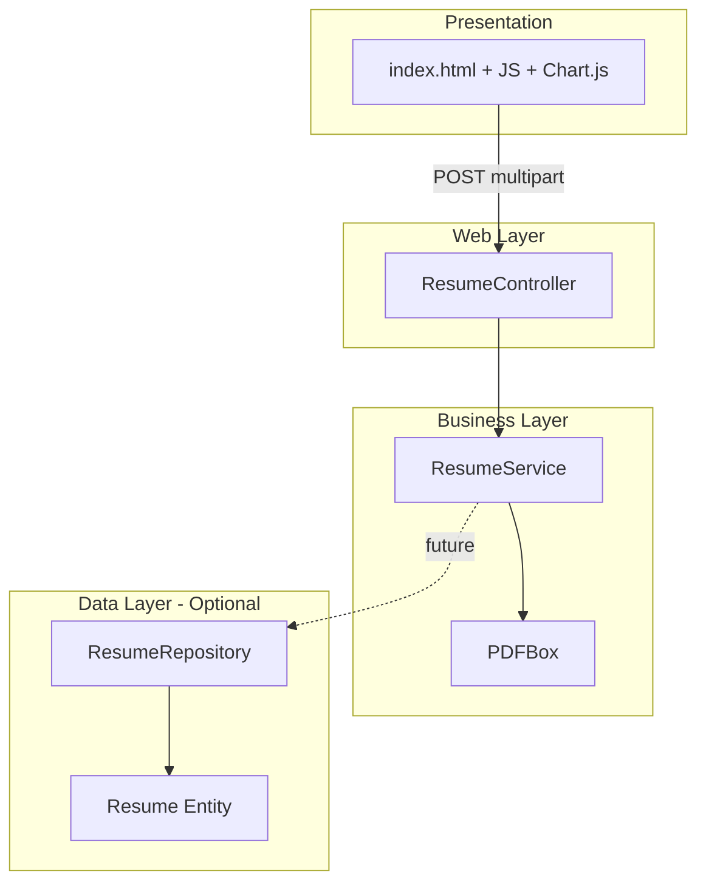

# Layers & Packages

## Layer model

ResumeDoc follows a classic **three-tier layout inside one Spring Boot app**:

```
┌─────────────────────────────────────────────────────────┐
│  Presentation (static UI + browser JavaScript)          │
├─────────────────────────────────────────────────────────┤
│  Web layer        Controller  — HTTP, params, response  │
├─────────────────────────────────────────────────────────┤
│  Business layer   Service     — PDF + analysis logic    │
├─────────────────────────────────────────────────────────┤
│  Data layer       Model + Repository  — optional JPA    │
└─────────────────────────────────────────────────────────┘
```

**v1 critical path:** Presentation → Controller → Service → (PDFBox + in-memory logic) → text response.

Repository/Model are **optional** and not required for the upload-analyze-dashboard demo.

---

## Package structure

Base package: `com.resume.analyzer`

```
com.resume.analyzer/
├── BackendApplication.java      # @SpringBootApplication entry point
├── controller/
│   └── ResumeController.java    # REST mapping /resume/upload
├── service/
│   └── ResumeService.java       # PDF parse + all analysis methods
├── model/
│   └── Resume.java              # JPA entity (optional scaffold)
└── repository/
    └── ResumeRepository.java    # JpaRepository (optional scaffold)
```

### Resources (non-Java)

```
src/main/resources/
├── application.properties       # Server, optional datasource
└── static/
    └── index.html               # UI + inline CSS + JS + Chart.js
```

### Tests

```
src/test/java/
└── .../BackendApplicationTests.java   # Spring context load smoke test
```

---

## Layer responsibilities

### Presentation — static UI (`static/index.html`)

| Does | Does not |
|------|----------|
| Render upload form and role dropdown | Parse PDFs |
| `fetch` POST to `/resume/upload` | Implement scoring rules |
| Parse response text with regex | Access database |
| Render Chart.js charts and cards | Enforce server-side validation beyond HTML `required` |

**Rule:** All business rules live server-side; UI is a thin client over the text API.

---

### Web layer — `controller`

**Class:** `ResumeController`  
**Annotations:** `@RestController`, `@RequestMapping("/resume")`

| Responsibility | Detail |
|----------------|--------|
| Map HTTP to Java | `@PostMapping("/upload")` |
| Bind request | `@RequestParam("file") MultipartFile`, `@RequestParam("role") String` |
| Delegate | Call `resumeService.processResume(file, role)` |
| Return HTTP | `ResponseEntity.ok(result)` |

| Does not | Why |
|----------|-----|
| PDF parsing | Belongs in service |
| Skill/ATS/score logic | Belongs in service |
| Database access | Belongs in repository (if used) |

**Design rule:** Controller stays thin — typically under ~30 lines for v1.

```java
// Pattern (conceptual)
@PostMapping("/upload")
public ResponseEntity<String> uploadResume(
        @RequestParam("file") MultipartFile file,
        @RequestParam("role") String role) {
    String result = resumeService.processResume(file, role);
    return ResponseEntity.ok(result);
}
```

---

### Business layer — `service`

**Class:** `ResumeService`  
**Annotation:** `@Service`

| Responsibility | Detail |
|----------------|--------|
| Orchestrate pipeline | `processResume(file, role)` coordinates all steps |
| PDF extraction | PDFBox: `PDDocument`, `PDFTextStripper` |
| Skill extraction | `extractSkills(text)` |
| Scoring | `calculateScore(skills)` |
| Suggestions | `getSuggestions(skills)` |
| Role matching | `matchJobRole(skills, role)` + `jobRoles()` map |
| ATS check | `checkATSScore(text)` + `getATSKeywords()` |
| Section detection | `detectSections(text)` |
| Career roadmap | `getJobSuggestions(skills, role)` |
| Format response | Concatenate labeled string for UI parsing |

| Does not | Why |
|----------|-----|
| HTTP status codes | Controller concern |
| SQL queries | Repository concern (if persisting) |
| DOM updates | Frontend concern |

**Design rule:** Private helper methods for each analysis concern; one public entry `processResume`.

**Error handling (v1):** Broad try/catch returns `"Error while processing resume ❌"` string.

---

### Data layer — `model` + `repository` (optional)

#### `Resume` entity (`model`)

| Field | Purpose |
|-------|---------|
| `id` | Primary key, `GenerationType.IDENTITY` |
| `fileName` | Example metadata for stored upload |

Annotations: `@Entity`, `@Id`, `@GeneratedValue`.

#### `ResumeRepository` (`repository`)

```java
public interface ResumeRepository extends JpaRepository<Resume, Long> { }
```

| Status in v1 | Detail |
|--------------|--------|
| Scaffold | May exist for learning JPA |
| Not on hot path | `ResumeService` does not call repository in reference flow |
| Future | Wire save-after-upload when history feature ships |

---

## Dependency direction

```
Controller  ──depends on──►  Service
Service     ──may depend on──►  Repository (future)
Repository  ──depends on──►  Model (entity)

Service     ──uses──►  PDFBox (library, not a Spring bean)
```

**Forbidden in v1:** Controller → Repository direct calls (skips business rules).  
**Forbidden:** Repository → Controller (inverted dependency).

Spring **constructor injection** (`@Autowired` on constructor or field) wires Controller → Service.

---

## Component diagram



Solid lines = v1 active path. Dotted = optional/future.

---

## Where to add new behavior

| Change | Layer |
|--------|-------|
| New REST endpoint | `controller` + possibly new service method |
| New scoring rule | `service` private method |
| New job role | `service` `jobRoles()` map + UI dropdown |
| JSON response format | `controller` return type + DTO class (new `dto` package) |
| Save upload history | `service` calls `repository.save()` |
| New chart on dashboard | `static/index.html` only |
| Input validation annotations | DTO + `@Valid` on controller (future) |

---

## Suggested future packages (not v1)

| Package | When |
|---------|------|
| `dto` | JSON API or request/response objects |
| `exception` | `@ControllerAdvice` for HTTP 4xx/5xx |
| `config` | CORS, security, profile-specific beans |

Keep v1 flat — extra packages only when a clear need appears.

---

## Layer ↔ requirements mapping

| Requirement | Layer |
|-------------|-------|
| F1 Upload endpoint | Controller |
| F2 Role param | Controller binding + Service consumption |
| F3 PDF extraction | Service + PDFBox |
| F4–F10 Analysis | Service helpers |
| F11 Dashboard | Static presentation |
| F12 Response format | Service builds string; Controller returns it |

---

## Link to prior context

Technology choices are in [tech-stack.md](./tech-stack.md). Next: **request-flow.md** — sequential steps from browser submit through each service method to dashboard render.
