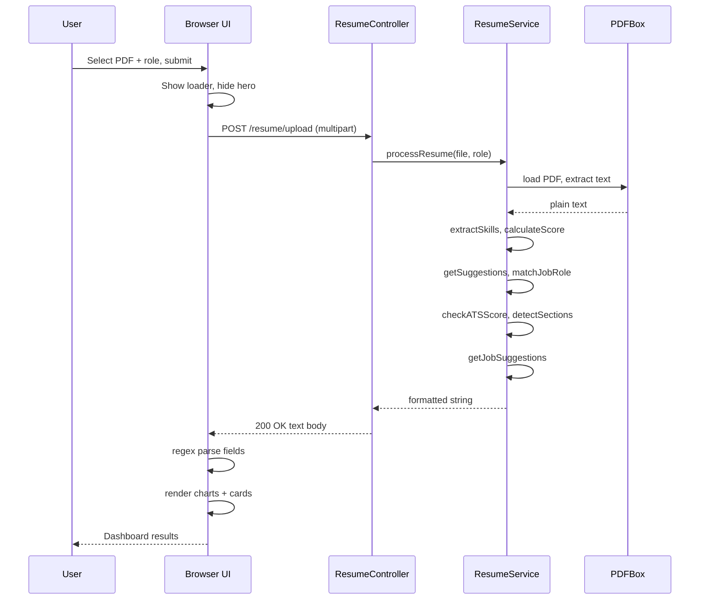
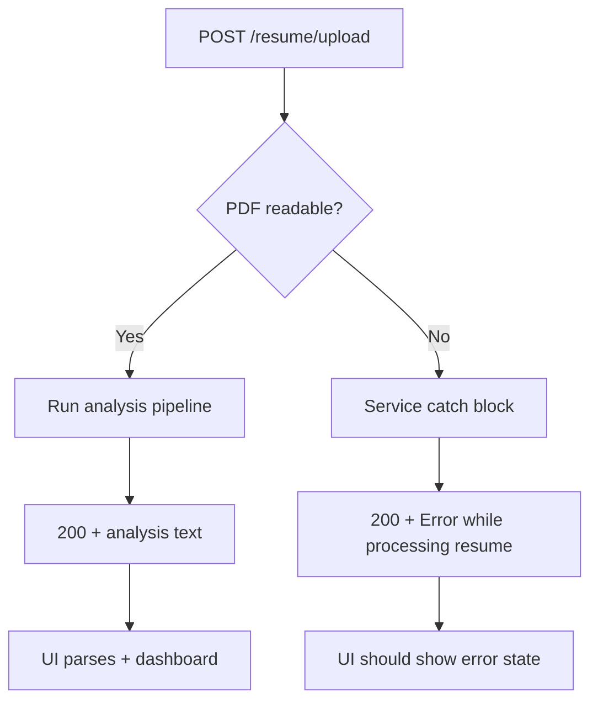

# Request Flow

## Flow summary

ResumeDoc handles one primary user action: **analyze my resume for this role**. The path crosses the browser, Spring MVC, the service pipeline, and back to the dashboard.

```
User submit  →  HTTP POST  →  Controller  →  Service.processResume()
      →  PDFBox  →  analysis steps  →  text body  →  JSON-less parse  →  dashboard cards
```

Total round-trip is synchronous: the browser waits for the full analysis before showing results.

---

## Step 0 — Page load (GET /)

| Step | Actor | Action |
|------|-------|--------|
| 0.1 | User | Opens `http://localhost:8080/` |
| 0.2 | Browser | `GET /` |
| 0.3 | Spring Boot | Serves `classpath:/static/index.html` |
| 0.4 | Browser | Renders hero, file input, role dropdown, hidden dashboard |

No API call on load. Chart.js script fetched from CDN.

---

## Step 1 — User submits form

| Step | Actor | Action |
|------|-------|--------|
| 1.1 | User | Selects PDF file and job role |
| 1.2 | User | Clicks submit (e.g. “Analyze Now”) |
| 1.3 | JS | `preventDefault()` on form submit |
| 1.4 | JS | Hides `#hero`, shows `#loader`, scrolls to top |
| 1.5 | JS | Builds `FormData`: `file`, `role` |

---

## Step 2 — HTTP request

| Property | Value |
|----------|-------|
| Method | `POST` |
| URL | `/resume/upload` (same origin `:8080`) |
| Body | `multipart/form-data` |
| Parts | `file` = PDF bytes, `role` = string |

```javascript
fetch("http://localhost:8080/resume/upload", {
  method: "POST",
  body: formData
});
```

Embedded Tomcat receives the request and dispatches to Spring MVC.

---

## Step 3 — Controller layer

| Step | Component | Action |
|------|-----------|--------|
| 3.1 | `DispatcherServlet` | Routes to `ResumeController` |
| 3.2 | `ResumeController` | Binds `MultipartFile file`, `String role` |
| 3.3 | `ResumeController` | Invokes `resumeService.processResume(file, role)` |
| 3.4 | `ResumeController` | Wraps result in `ResponseEntity.ok(result)` |
| 3.5 | Tomcat | Writes `200 OK`, `text/plain` body |

Controller adds no transformation in v1 — service string is the response body.

---

## Step 4 — Service entry (`processResume`)

| Step | Action | Output |
|------|--------|--------|
| 4.1 | `file.getInputStream()` | `InputStream` |
| 4.2 | `PDDocument.load(inputStream)` | Open PDF |
| 4.3 | `PDFTextStripper.getText(document)` | `String text` |
| 4.4 | `document.close()` | Release handles |

**Failure branch:** Any exception → catch → return `"Error while processing resume ❌"` (no rethrow in v1).

---

## Step 5 — Analysis pipeline (in order)

The service runs these steps **sequentially** on extracted `text` and derived `skills`:

| Order | Method | Input | Output |
|-------|--------|-------|--------|
| 5.1 | `extractSkills(text)` | Full resume text | `List<String> skills` |
| 5.2 | `calculateScore(skills)` | Skills list | `int score` (0–100) |
| 5.3 | `getSuggestions(skills)` | Skills list | `List<String> suggestions` |
| 5.4 | `matchJobRole(skills, role)` | Skills + role | Block: Role, Match %, Missing skills |
| 5.5 | `checkATSScore(text)` | Full text | Block: ATS %, Missing keywords |
| 5.6 | `detectSections(text)` | Full text | Block: Skills/Education/Experience status |
| 5.7 | `getJobSuggestions(skills, role)` | Skills + role | Block: Career roadmap lines |

**Data dependencies:**

- Steps 5.2, 5.3, 5.4, 5.7 depend on **skills** (from 5.1).
- Steps 5.5, 5.6 use **raw text** (not skills list).
- Step 5.4 and 5.7 use **role** from the HTTP request.

---

## Step 6 — Response assembly

Service concatenates segments in fixed order:

```text
Skills: {skills}
Score: {score}/100
Suggestions: {suggestions}

{jobMatch block}

{atsResult block}

{sectionResult block}

{jobSuggestions block}
```

This ordering matches [api-contract.md](../requirements/api-contract.md) and frontend regex expectations.

---

## Step 7 — HTTP response to browser

| Step | Action |
|------|--------|
| 7.1 | `fetch` promise resolves with `res.text()` |
| 7.2 | JS receives single string `data` |

If body starts with error message, UI should not treat as successful analysis (hardening recommendation).

---

## Step 8 — Client-side parsing

| Field | Extraction |
|-------|------------|
| Skills | `/Skills: \[(.*?)\]/` → split by comma |
| Score | `/Score: (\d+)/` |
| Suggestions | `/Suggestions: \[(.*?)\]/` |
| ATS score | `/ATS Score: (\d+)%/` |
| ATS missing | `/Missing Keywords: \[(.*?)\]/` |
| Sections | `/Resume Sections:\n([\s\S]*?)\n\n/` |
| Roadmap | `/Career Roadmap[\s\S]*/` |

Role match lines remain inside raw text; roadmap regex may include role block depending on match boundaries.

---

## Step 9 — Dashboard render

| Step | UI target | Content |
|------|-----------|---------|
| 9.1 | Hide loader, show `#dashboard` | Toggle visibility |
| 9.2 | `#skills` | `<span>` per skill |
| 9.3 | `#scoreChart` + `#scoreText` | Chart.js doughnut + `N / 100` |
| 9.4 | `#barChart` | Bar chart with skill labels |
| 9.5 | `#suggestions` | `<li>` per suggestion |
| 9.6 | `#atsScore`, `#atsMissing` | ATS summary |
| 9.7 | `#sections` | Section status text |
| 9.8 | `#roadmap` | Career roadmap text |
| 9.9 | `#ai` | Client-computed insight from score bands |

Chart instances destroyed before redraw if user analyzes again in same session.

---

## Sequence diagram



---

## Parallel paths not taken (v1)

| Path | Status |
|------|--------|
| Save to MySQL via Repository | Not invoked in reference `processResume` |
| Async / `@Async` processing | Synchronous only |
| WebSocket progress updates | Not used |
| Separate frontend dev server proxy | Same-origin 8080 only |

---

## Timing characteristics

| Stage | Relative cost |
|-------|----------------|
| Network upload | Depends on PDF size |
| PDFBox parse | Small PDFs: milliseconds |
| Keyword scans | Linear in text length; negligible for 1–2 page resumes |
| Chart render | Client-side; after response arrives |

No caching layer. Each submit is a fresh full analysis.

---

## Error flow



v1 returns HTTP 200 even on processing errors; status-code improvement is future hardening.

---

## Flow ↔ layer mapping

| Flow step | Layer |
|-----------|-------|
| 0–1, 8–9 | Presentation (`static/`) |
| 2–3, 7 | Web (`controller`) |
| 4–6 | Business (`service` + PDFBox) |

---

## Link to prior context

Layer boundaries are in [layers-and-packages.md](./layers-and-packages.md). Next: **diagrams.md** — consolidated architecture views (system, deployment, data).
