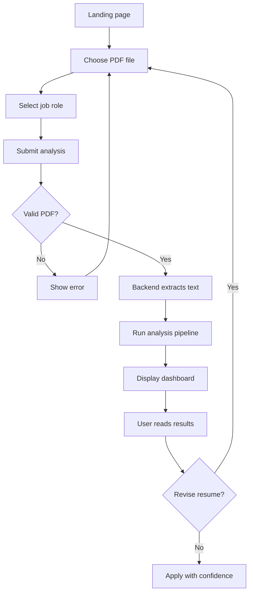

# User Flow

## Flow at a glance

```
Land on home  →  upload PDF + pick role  →  analyze  →  view dashboard  →  (optional) revise & re-run
```

The entire core journey happens in one browser session without sign-in. The user arrives with a resume file and a target role in mind; they leave with measurable feedback and a list of improvements.

---

## Step 1 — Arrive on the landing page

**Screen:** Hero section with navbar, headline, and upload card.

| Element | Purpose |
|---------|---------|
| Navbar / logo | Orientation; product identity |
| Headline | Communicates instant resume analysis value |
| Subtext | Sets expectation: ATS score, skills, improvements |

**User mindset:** “I have a PDF ready. I want to know if it is good enough before I apply.”

**Entry points:**
- Local dev URL (e.g. `http://localhost:8080/`)
- Future: deployed link shared from portfolio or career office

No authentication gate. The hero is the primary call to action.

---

## Step 2 — Select resume file

**Action:** User chooses a PDF via the file input.

| Requirement | Rationale |
|-------------|-----------|
| Format: PDF | Matches what most job portals accept |
| File required | Analysis cannot run without source document |

**Validation (client):** Form blocks submit until a file is chosen.

**Edge cases (later implementation):**
- Non-PDF file → clear error message
- Empty or corrupt PDF → graceful failure, no crash

---

## Step 3 — Choose target job role

**Action:** User picks one role from a dropdown before submitting.

| Option | Used for |
|--------|----------|
| Java Developer | Backend-oriented skill and keyword matching |
| Full Stack Developer | Full-stack skill set comparison |
| Data Analyst | Data-focused skill expectations |

**Why role comes before results:** Match score, missing skills, and career roadmap all depend on the selected role. The same PDF may score differently against different targets.

**Validation (client):** Role selection is required; user cannot submit with a blank option.

---

## Step 4 — Submit for analysis

**Action:** User clicks the primary button (e.g. “Analyze Now”).

**Immediate UI changes:**
1. Hero section hides (focus shifts to results)
2. Loading indicator appears
3. Page scrolls to top

**Behind the scenes:**
```
Browser  --POST multipart/form-data-->  /resume/upload
           fields: file (PDF), role (string)
```

The backend extracts text, runs skill detection, scoring, ATS checks, section scan, role matching, and suggestion logic, then returns a structured text response the frontend parses.

---

## Step 5 — View the results dashboard

**Screen:** Dashboard grid replaces the upload hero. Cards present each dimension of feedback.

### Primary row

| Card | Content |
|------|---------|
| Score | Doughnut chart + numeric score out of 100 |
| Skills | Detected skills as tags |
| Skill analysis | Bar chart visualizing skill presence |

### Secondary row

| Card | Content |
|------|---------|
| Suggestions | Bullet list of improvement tips |
| Insight | Plain-language summary tier based on score band |
| ATS analysis | ATS match percentage + missing keywords |
| Resume sections | Skills / Education / Experience — found or missing |
| Career roadmap | Role-specific learning and project guidance |

**User mindset:** “Now I can see gaps I did not notice in Word.”

**Parsing note:** The UI reads labeled segments from the backend response (skills array, score, suggestions, ATS %, sections block, roadmap text) and maps each to the correct card.

---

## Step 6 — Interpret and act

**Typical user actions after results load:**

1. Check **score** and **insight** for overall health
2. Compare **detected skills** vs what they thought was on the page
3. Read **ATS missing keywords** and add terms to bullet points
4. Review **section checklist** for structural fixes
5. Follow **career roadmap** for next learning steps
6. Note **suggestions** for quick wins

**Outcome:** User edits resume offline (Word, Google Docs, LaTeX, etc.) with specific targets in mind.

---

## Step 7 — Iterate (optional loop)

The product does not persist sessions in the initial scope. To compare versions:

1. User revises the PDF locally
2. Refreshes or returns to the app
3. Re-uploads the new file with the same or different role
4. Compares new dashboard metrics to the previous run from memory or screenshots

This loop is intentional: fast feedback encourages revision before mass applying.

---

## End-to-end diagram



---

## Flow by persona

| Step | Alex (student) | Jordan (junior dev) |
|------|----------------|---------------------|
| Role choice | Full Stack or Java Developer | Compares both across two runs |
| Key card | Sections + suggestions | ATS % + role match gaps |
| Loop | Re-upload after adding project | Re-upload after keyword tweaks |

---

## Out of scope for this flow

- User registration or saved history
- Multiple files in one submission
- Inline PDF editing inside the app
- Exporting results as PDF (future enhancement)

---

## Link to prior context

This journey implements the value described in [value-proposition.md](./value-proposition.md) for the users defined in [user-personas.md](./user-personas.md). The final definition document captures product naming, goals, and a wrap-up of the idea.
