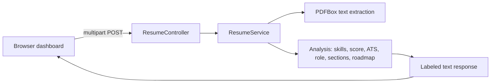

# How It Works

## Purpose

Explain the system for a developer new to the project: architecture, request flow, and where each piece of logic lives.

Consolidates [architecture/](../architecture/) and the implementation segments.

---

## High-level architecture

ResumeDoc is a monolithic Spring Boot application with a static browser frontend.

See [layers-and-packages.md](../architecture/layers-and-packages.md).

---

## Request flow

1. User uploads a PDF and selects a role on `index.html`.
2. Browser sends `multipart/form-data` to `POST /resume/upload`.
3. `ResumeController` binds `file` and `role`, calls `ResumeService.processResume`.
4. `ResumeService`:
   - extracts text with PDFBox,
   - detects skills, computes score, builds suggestions,
   - matches the role, computes ATS coverage,
   - detects sections, builds the career roadmap,
   - assembles a labeled text response.
5. Browser parses the text and renders charts and cards.

See [request-flow.md](../architecture/request-flow.md).

---

## Where logic lives

| Concern | Location | Doc |
|---------|----------|-----|
| HTTP mapping | `controller/ResumeController` | [controller-design.md](../api-layer/controller-design.md) |
| Orchestration | `service/ResumeService.processResume` | [sections-roadmap/implementation.md](../sections-roadmap/implementation.md) |
| Text extraction | PDFBox in service | [pdf-extraction/implementation.md](../pdf-extraction/implementation.md) |
| Skills/score/suggestions | service helpers | [scoring/implementation.md](../scoring/implementation.md) |
| ATS | service helpers | [ats-analysis/implementation.md](../ats-analysis/implementation.md) |
| Role match | service helpers | [role-matching/implementation.md](../role-matching/implementation.md) |
| Sections/roadmap | service helpers | [sections-roadmap/implementation.md](../sections-roadmap/implementation.md) |
| UI | `resources/static/index.html` | [frontend/overview.md](../frontend/overview.md) |

---

## Response contract

The service returns one labeled plain-text body; the client parses it with regex. Block order and labels are fixed — see [response-assembly.md](../sections-roadmap/response-assembly.md) and [api-contract.md](../requirements/api-contract.md).

---

## Design decisions (recap)

| Decision | Rationale |
|----------|-----------|
| Monolith + static UI | Simple to build, run, and demo |
| Plain-text labeled response | Fast to ship in v1; JSON is future scope |
| Keyword-based analysis | Deterministic, no ML dependency |
| No persistence required | Analysis is stateless per upload |

---

## Checklist

- [ ] Architecture diagram included
- [ ] Request flow steps listed
- [ ] Logic-location table accurate
- [ ] Response contract linked
- [ ] Design decisions recorded

---

## Link to prior context

README: [readme-content.md](./readme-content.md).  
Next: [run-guide.md](./run-guide.md) — how to build and run.
