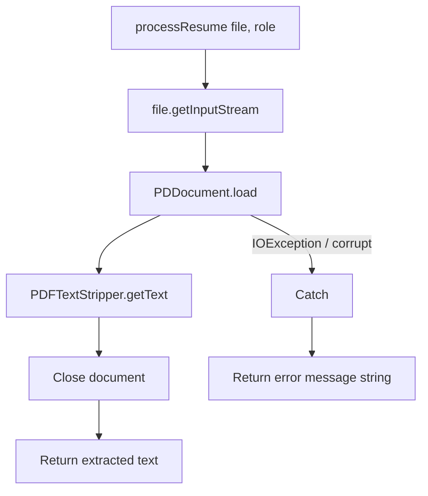

# Extraction Flow

## Purpose

Document the ordered steps inside `ResumeService.processResume` for this segment: turn an uploaded PDF into a plain-text string, then return or hand off that text. Controller stays unchanged; analysis helpers are not required yet.

---

## Entry point

```java
public String processResume(MultipartFile file, String role)
```

| Parameter | Use at extraction stage |
|-----------|-------------------------|
| `file` | Source of PDF bytes via `getInputStream()` |
| `role` | Unused for extraction; keep the param for later matching |

---

## Happy-path steps

| Step | Action | Result |
|------|--------|--------|
| 1 | Obtain stream | `InputStream` from `file.getInputStream()` |
| 2 | Load PDF | `PDDocument.load(inputStream)` |
| 3 | Create stripper | `new PDFTextStripper()` |
| 4 | Extract text | `stripper.getText(document)` → `String text` |
| 5 | Close document | `document.close()` or try-with-resources exit |
| 6 | Return for verify | HTTP body = `text` (or preview) so Postman can confirm |

### Step diagram



---

## Detailed step notes

### 1 — Input stream

```java
InputStream inputStream = file.getInputStream();
```

- Do not require saving the PDF to disk for v1
- Empty file may still reach load and fail in step 2 — handle in catch

### 2 — Load document

```java
PDDocument document = PDDocument.load(inputStream);
```

- Parses PDF structure into memory
- Failure → exceptions caught → user-facing error string (see [error-handling.md](./error-handling.md))

### 3–4 — Strip text

```java
PDFTextStripper pdfStripper = new PDFTextStripper();
String text = pdfStripper.getText(document);
```

- Order of pages follows document page order
- Text may include newlines and whitespace as in the PDF
- Case of content is preserved here; later skill scan will lowercase a copy

### 5 — Close

Always release the document so repeated uploads do not leak handles.

```java
document.close();
```

Prefer try-with-resources so close happens on success and failure of extract.

### 6 — Temporary response (verification)

For this segment only, return something the client can read:

**Option A — full text**

```java
return text;
```

**Option B — preview + length** (safer if resumes are large)

```java
return "Extracted characters: " + text.length()
     + "\n\n"
     + text.substring(0, Math.min(text.length(), 2000));
```

**Option C — labeled wrapper** (clear Postman signal)

```java
return "Extracted Text:\n" + text;
```

Any option is fine for verification. Later segments replace the return with a labeled analysis body that **uses** `text` without exposing every character to the UI.

---

## Failure branch

| Condition | Handling |
|-----------|----------|
| Not a PDF / corrupt bytes | catch → `"Error while processing resume ❌"` |
| PDFBox IOException | same catch |
| Unexpected runtime error | same catch |

```java
} catch (Exception e) {
    e.printStackTrace(); // optional: log for developer
    return "Error while processing resume ❌";
}
```

HTTP status remains `200` with error string in v1 (same as api-contract). Server process must stay alive.

---

## What stays out of this flow (later)

| Call | Segment |
|------|---------|
| `extractSkills(text)` | Scoring |
| `calculateScore(skills)` | Scoring |
| `checkATSScore(text)` | ATS |
| `matchJobRole(skills, role)` | Role matching |
| `detectSections(text)` | Sections |
| Labeled multi-block API body | After analysis pieces exist |

Extraction flow **ends** once `String text` is reliable.

---

## Flow checklist

- [ ] Stream opened from `MultipartFile`
- [ ] `PDDocument.load` before strip
- [ ] `getText` assigned to a `String`
- [ ] Document closed after extract
- [ ] Success returns text (or preview) for Postman check
- [ ] Failure returns clear error string; no crash

---

## Link to prior context

Setup: [pdfbox-setup.md](./pdfbox-setup.md).  
Next: [implementation.md](./implementation.md) — full `ResumeService` source for the extraction stage.
