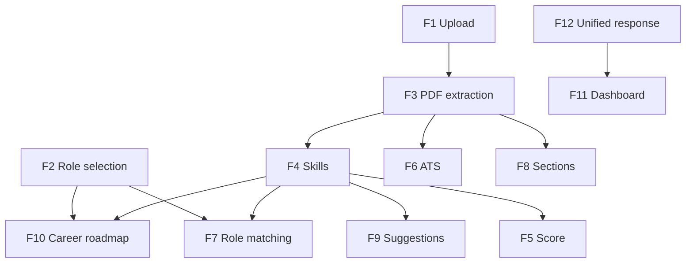

# Must-Have Features (v1)

## Checklist summary

Every item below is **required** for ResumeDoc v1. If it is unchecked at release, v1 is not complete.

| # | Feature | Status target |
|---|---------|---------------|
| F1 | PDF resume upload via HTTP | Required |
| F2 | Job role selection (3 roles) | Required |
| F3 | PDF text extraction | Required |
| F4 | Skill extraction from resume text | Required |
| F5 | Resume score (0–100) | Required |
| F6 | ATS keyword analysis | Required |
| F7 | Job role matching | Required |
| F8 | Resume section detection | Required |
| F9 | Smart suggestions | Required |
| F10 | Career roadmap (role-based) | Required |
| F11 | Interactive dashboard UI with charts | Required |
| F12 | Unified analysis response for UI parsing | Required |

---

## F1 — PDF resume upload

**What:** User submits a resume file through a multipart HTTP request.

| Detail | Specification |
|--------|---------------|
| Endpoint | `POST /resume/upload` |
| File param | `file` — PDF document |
| Role param | `role` — string matching a supported job title |
| Success | HTTP 200 with analysis body |
| Failure | Clear error message in response body (invalid or unreadable file) |

**User-facing:** File input on landing page; submit blocked until file is chosen.

---

## F2 — Job role selection

**What:** User picks one target role before analysis runs.

| Supported role | Purpose |
|----------------|---------|
| Java Developer | Backend-focused skill expectations |
| Full Stack Developer | Full-stack skill expectations |
| Data Analyst | Data-focused skill expectations |

Role drives match score, missing skills, and career roadmap content. Analysis must not run with an empty role in the UI.

---

## F3 — PDF text extraction

**What:** Backend reads the uploaded PDF and produces plain text for all downstream checks.

| Detail | Specification |
|--------|---------------|
| Library | Apache PDFBox |
| Output | Single string of extracted text |
| Resource handling | Document closed after read (try-with-resources or equivalent) |
| Dependency | All analysis features depend on this step |

Without reliable extraction, skills, ATS, and section detection cannot run.

---

## F4 — Skill extraction

**What:** Scan lowercased resume text for known technical keywords and return a list of matched skills.

| Detected keyword (in text) | Normalized skill name |
|----------------------------|----------------------|
| `java` | Java |
| `spring` | Spring Boot |
| `mysql` or `sql` | SQL |
| `html` | HTML |
| `css` | CSS |
| `javascript` | JavaScript |

**Output:** Ordered list of unique matched skills (may be empty).

**Method:** Case-insensitive substring match on full resume text.

---

## F5 — Resume score (0–100)

**What:** Weighted numeric score based on detected skills from F4.

| Skill | Points |
|-------|--------|
| Java | +20 |
| Spring Boot | +20 |
| SQL | +20 |
| JavaScript | +20 |
| HTML | +10 |
| CSS | +10 |

**Maximum:** 100 (all skills present).

**Output:** Integer score included in API response (e.g. `Score: 75/100`).

---

## F6 — ATS keyword analysis

**What:** Measure how many common hiring keywords appear in the resume text.

**Keyword set (v1):**

`java`, `spring`, `spring boot`, `rest api`, `microservices`, `mysql`, `sql`, `hibernate`, `docker`, `kubernetes`, `aws`, `javascript`, `html`, `css`

| Output field | Calculation |
|--------------|-------------|
| ATS score % | `(matched keywords / total keywords) × 100` |
| Missing keywords | List of keywords not found in text |

Case-insensitive matching on lowercased resume text.

---

## F7 — Job role matching

**What:** Compare detected skills (F4) against required skills for the selected role (F2).

| Role | Required skills |
|------|-----------------|
| Java Developer | Java, Spring Boot, SQL |
| Full Stack Developer | Java, JavaScript, HTML, CSS |
| Data Analyst | SQL, Python, Excel |

| Output field | Calculation |
|--------------|-------------|
| Match score % | `(matched required / total required) × 100` |
| Missing skills | Required skills not in detected list |

Response includes role name, match percentage, and missing skills list.

---

## F8 — Resume section detection

**What:** Check whether standard section headings appear in resume text.

| Section | Detection rule |
|---------|----------------|
| Skills | Text contains `"skills"` (case-insensitive) |
| Education | Text contains `"education"` |
| Experience | Text contains `"experience"` |

**Output per section:** `Found ✅` or `Missing ❌`

Displayed as a labeled block in the API response for UI rendering.

---

## F9 — Smart suggestions

**What:** General improvement tips based on skills **not** detected in the resume.

| Missing skill | Example suggestion |
|---------------|-------------------|
| Java | Build strong foundation in Java with OOP concepts |
| Spring Boot | Create a REST API project using Spring Boot |
| SQL | Practice database queries and learn MySQL deeply |
| JavaScript | Work on frontend using JavaScript and build projects |
| HTML or CSS | Improve frontend skills using HTML, CSS and responsive design |

**Additional rule:** If fewer than 3 skills detected overall, add suggestion to include at least 2 real-world projects.

**Output:** List of suggestion strings in API response.

---

## F10 — Career roadmap (role-based)

**What:** Role-specific learning and project guidance beyond general suggestions (F9).

| Role | Roadmap themes |
|------|----------------|
| Java Developer | Spring Boot REST APIs, MySQL, Java fundamentals, backend project |
| Full Stack Developer | JavaScript, HTML/CSS, full stack project |
| Data Analyst | Python, SQL, data visualization, real datasets |

**Output:** Labeled block starting with `Career Roadmap for {role}:` followed by suggestion lines.

---

## F11 — Interactive dashboard UI

**What:** Single-page browser UI served as static assets; calls upload endpoint and visualizes results.

| UI area | Displays |
|---------|----------|
| Hero / upload | File input, role dropdown, submit button |
| Loading | Spinner while request is in flight |
| Score card | Doughnut chart + `score / 100` text |
| Skills card | Skill tags from detected list |
| Skill analysis card | Bar chart (Chart.js) |
| Suggestions card | Bulleted list from F9 |
| Insight card | Score-band summary message |
| ATS card | ATS % and missing keywords |
| Sections card | Skills / Education / Experience status |
| Roadmap card | Career roadmap text from F10 |

**Tech:** HTML, CSS, JavaScript, Chart.js (CDN). Dark theme with card-based layout.

**Flow:** Hide hero after submit; show dashboard when response returns.

---

## F12 — Unified analysis response

**What:** Single plain-text (or parseable) response body combining all analysis outputs so the dashboard can extract fields with regex or structured parsing.

**Minimum labeled segments in response:**

- `Skills: [...]`
- `Score: N/100`
- `Suggestions: [...]`
- Role block: `Role:`, `Match Score:`, `Missing Skills:`
- ATS block: `ATS Score:`, `Missing Keywords:`
- Section block: `Resume Sections:` with three lines
- Roadmap block: `Career Roadmap for {role}:`

Frontend parsing depends on stable labels; changing format requires coordinated UI update.

---

## Feature dependencies

---

## Out of scope for this checklist

Items intentionally **not** on the must-have list (see `future-scope.md`):

- User login and upload history
- OpenAI or external AI integration
- React frontend rewrite
- DOCX / image upload
- JSON API response format (v1 uses parseable text)
- Resume persistence to database (optional scaffold only)

---

## Link to prior context

This checklist implements the capabilities promised in [value-proposition.md](../definition/value-proposition.md) and scoped in [overview.md](./overview.md). Next: deferred features and future enhancements.
